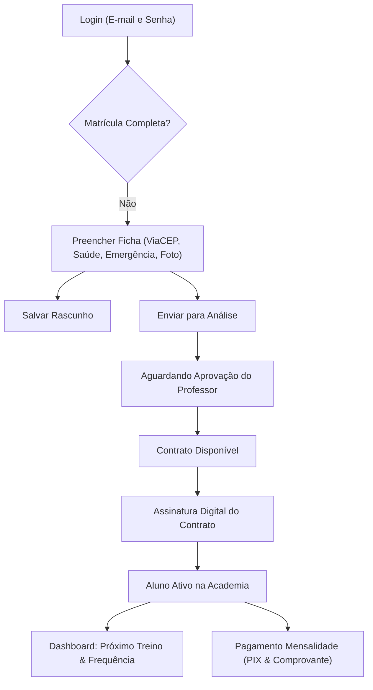
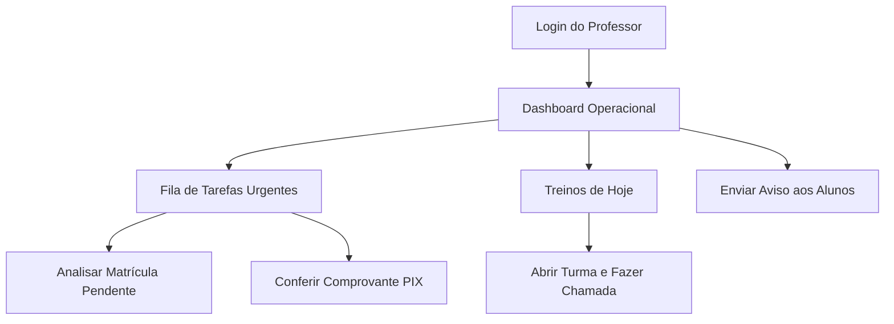
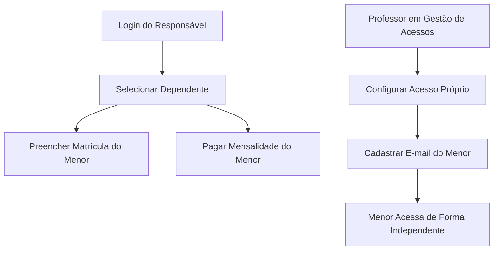

# Jornadas de Usuário e Navegação Contextual — Ebener TKD (R1)

Mapeamento completo dos fluxos operacionais por perfil, cobrindo objetivos, passos, resultados esperados e tratamento de erros.

---

## 1. Fluxo do Aluno Adulto

### Passos da Jornada:
1. **Entrada**: Aluno faz login com e-mail e senha.
2. **Matrícula**:
   - Digita CEP: os campos de Rua, Bairro, Cidade e Estado são preenchidos automaticamente via API do ViaCEP, com o cursor avançando para o Número.
   - Informa contato de emergência e histórico de Taekwondo.
   - Anexa foto de perfil (obrigatória) e atestado médico (opcional).
   - Pode salvar como rascunho sem perder progresso ou submeter para análise.
3. **Contrato**:
   - Assim que o professor aprova os documentos e define o valor/turma, o contrato é emitido.
   - Aluno confere os termos e assina com um clique.
4. **Rotina de Treinos**:
   - Acessa o dashboard e visualiza imediatamente se tem treino hoje ou quando será a próxima aula.
   - Acompanha sua frequência aula a aula.

---

## 2. Fluxo do Professor / Administrador

### Passos da Jornada:
1. **Entrada**: Professor visualiza o dashboard com a fila de pendências reais no topo (alunos aguardando aprovação e comprovantes PIX enviados).
2. **Revisão de Matrícula**:
   - Clica em "Analisar" direto no card do aluno.
   - Avalia a foto e os dados médicos/emergência.
   - Ajusta valor da mensalidade e dia de vencimento.
   - Avança para geração de contrato.
3. **Chamada de Aula**:
   - No bloco "Treinos de hoje", clica em "Iniciar chamada".
   - Marca presenças e faltas justificadas de forma rápida no celular.

---

## 3. Fluxo do Responsável e Dependente Menor

### Regras de Transição e Contexto:
- O responsável gerencia todos os dependentes a partir de uma visão centralizada sem misturar cobranças entre irmãos.
- O aluno menor tem login simplificado por usuário/senha.
- Quando o aluno atinge idade/maturidade para acessar sozinho, o professor utiliza a ação contextual **"Configurar acesso próprio"** na tabela de acessos, informando o e-mail do aluno e preservando opcionalmente o acesso de consulta do responsável.
